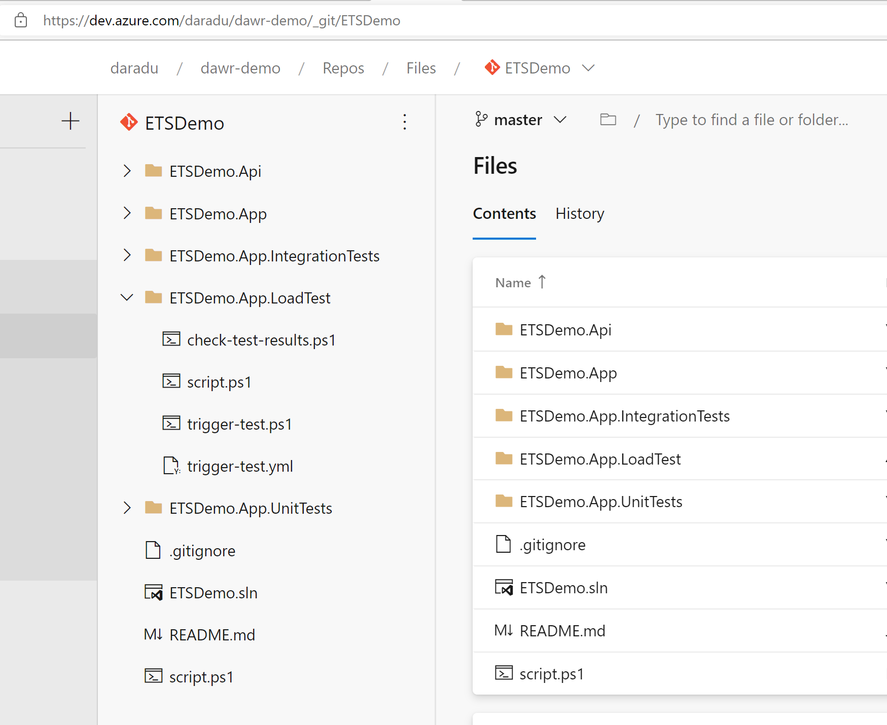
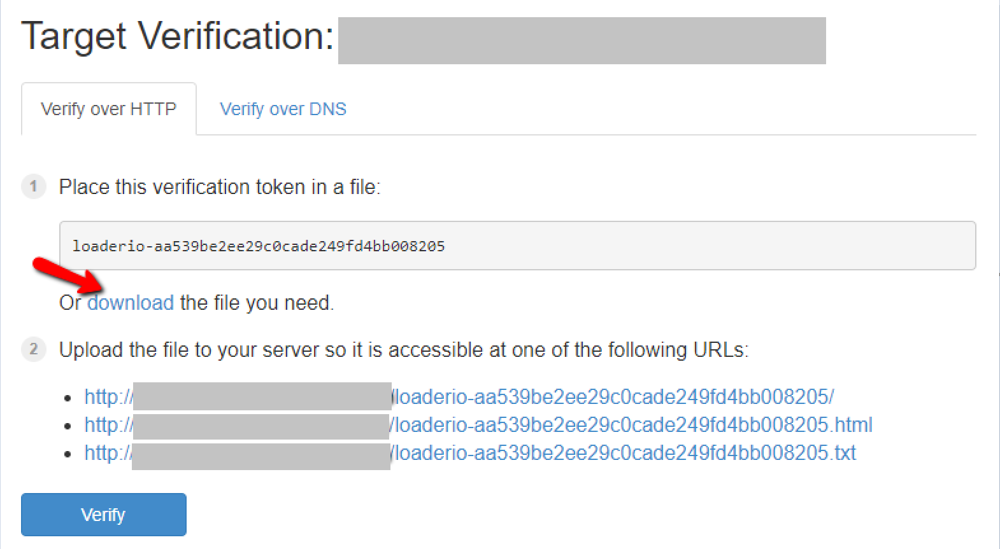
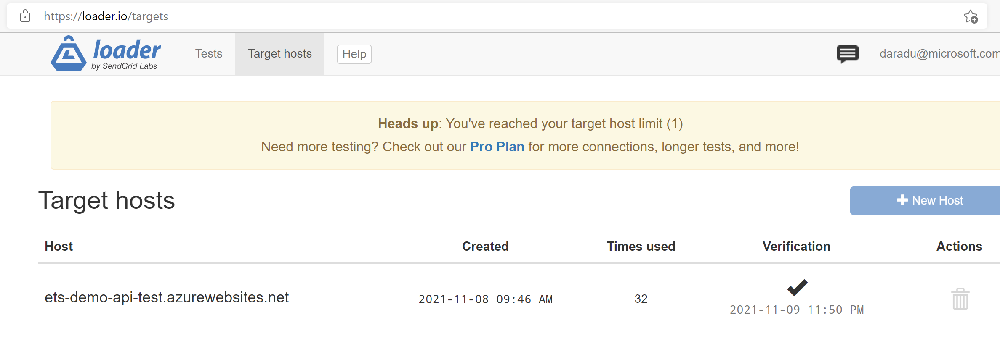
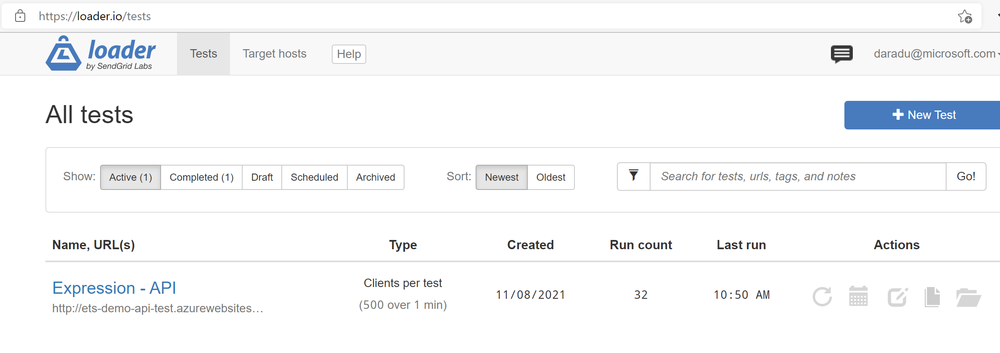
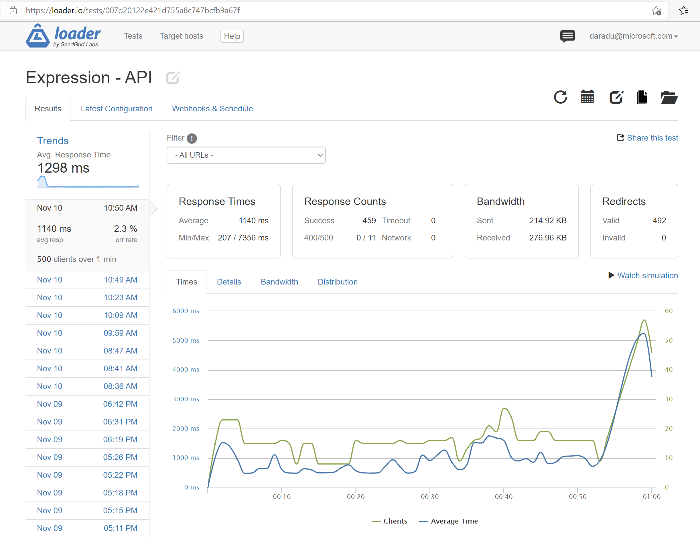
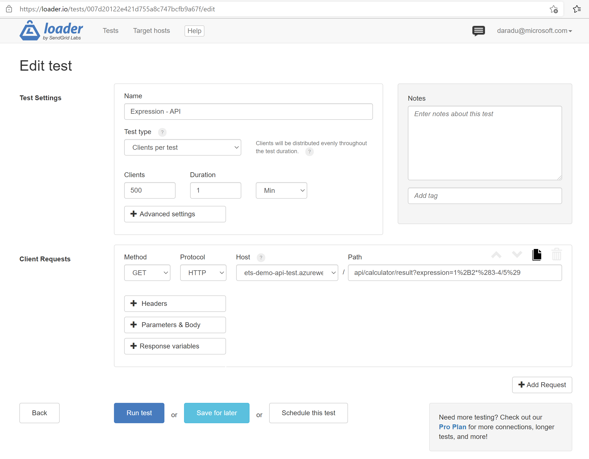
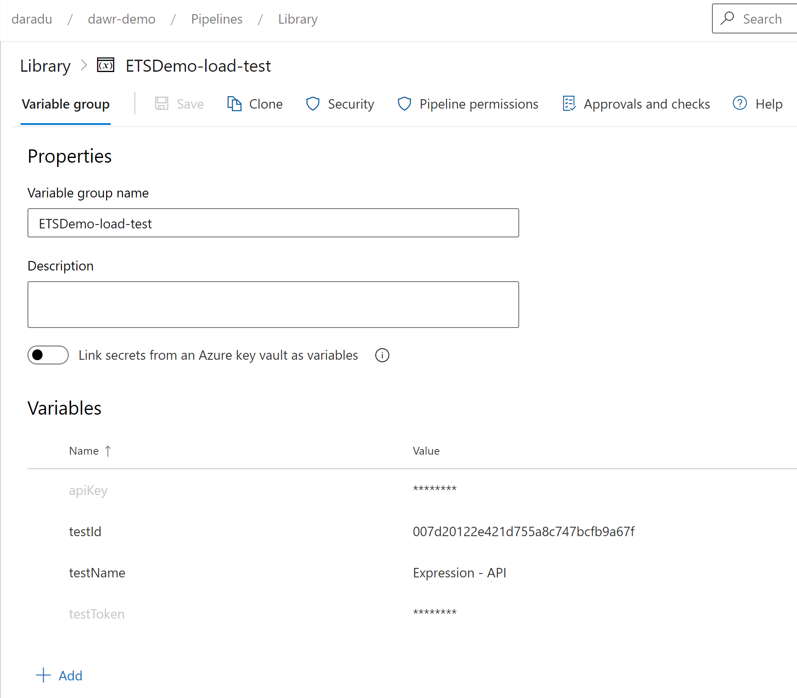
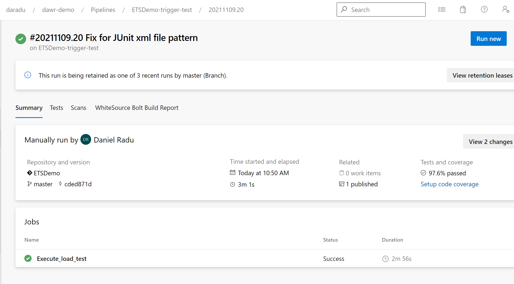
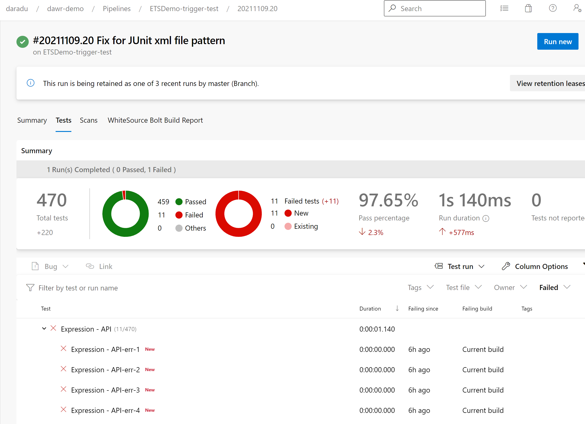

# Introduction

This guide shows how to use loader.io for running load / performance testing against a public facing web site / application / API.

The use case is the execution of an API using multiple users simulation.

The guide goes through the steps of configuring and running load tests both manually and from an Azure DevOps pipeline using loader.io API.

This is the repository link used for this guide:

https://dev.azure.com/daradu/dawr-demo/_git/ETSDemo

The script files used in this guide are located under *ETSDemo.App.LoadTest* folder: 



# Initial investigation

- loader.io is ideal for public websites / APIs; it has various plans and the free one (with a single host) is very good for investigation and assessment (unclear about private apps)

- Once the host target is added, loader.io requires verification - this is to prevent DDOS attacks and misuse of the tool

The verification requires a token to be added to the target web app / API. 

It is easy with web apps as you can add a text file which the web server can serve it easily for verification, but for APIs and apps which use routing might require code changes to integrate the token endpoint.

- The tests are customisable and require the endpoint to hit and number of users within a specified time interval (in minutes or seconds). 

You can specify the request method (GET, POST, PUT, etc.), protocol (HTTP / HTTPS), use basic authentication, add headers, configure  parameters and request body.

The tests support multiple requests.

- Tests can be managed via a simple API.

To call an API simply provide the endpoint, parameters and the API key as header.

Header: `loaderio-auth`

Api Key: `<your API key>`

- Webhooks can be used in a CI/CD pipeline to trigger tests - they simply fire the test without waiting for completion

Webhook: https://api.loader.io/v2/tests/:test_id

- The test results can be queried via an API

Results: https://api.loader.io/v2/tests/:test_id/results

Result: https://api.loader.io/v2/tests/:test_id/results/:result_id

As there is no guarantee when the test will complete, polling is recommended to check the results. 

Verify the results status and when ready, call the corresponding result endpoint to get the result data.


# Pre-requisites

- A loader.io account - for initial investigation and discovery a free plan can be used

If more hosts are needed and for more features, paid plans are available. 

- A public web site / application / API

For our use case we target the following API, based on ETS Demo Calculator app:

https://ets-demo-api-test.azurewebsites.net/api/calculator/result?expression=1%2B2*%283-4/5%29

It executes a simple math expression and returns the result:

``` JSON
{"expression":"1+2*(3-4/5)","result":5.4}
```

- An Azure DevOps account with approriate contributor Git repo and pipeline permissions

- PowerShell for test execution scripts (call loader.io API)

Alternatively, bash or cmd can be used with tools such `curl`.


# Load Tests Execution

## Target Hosts

Once you create a loader.io account, you can create one or more target hosts (the system under test - SUT).

Loader.io enforces the verification of the target host to ensure that user has access and doesn't target other systems accidentally or in purpose.

The endpoints used for verification look like the following:



If the target host is a website or an application that is able to serve files directly, you can simply put the generated host token in a file and let loader.io verify.

However, if you are targetting an application or API which has its own routing mechanism, things are a bit more complicated as you need to make changes in your app / API to allow loader.io to call the endpoint.

For our API call, we added a token endpoint to the API which is called by loader.io to verify the host.

This token endpoint is in `HomeController` class, `Verify` action. It simply loads the token from a file and returns it.
To fullfil the loader.io requirements, we named our route explicitly `loaderio-7a62593b48aa03b24119159a266d2c88.txt`. This is the verification endpoint:

https://ets-demo-api-test.azurewebsites.net/loaderio-7a62593b48aa03b24119159a266d2c88.txt

This is a snippet of the `HomeController.Verify` action:

``` C#
    [ApiController]
    [Route("loaderio-7a62593b48aa03b24119159a266d2c88.txt")]
    public class HomeController : ControllerBase
    {


        public HomeController()
        {
        }

        [HttpGet("")]
        public IActionResult Verify()
        {
            var content = System.IO.File.ReadAllText("./loaderio-7a62593b48aa03b24119159a266d2c88.txt");
            return Ok(content);
        }
    }
```

Full code for the verification endpoint can be found in the *ETSDemo.App.Api* folder:

https://dev.azure.com/daradu/dawr-demo/_git/ETSDemo?path=/ETSDemo.Api/Controllers/HomeController.cs

If the verification is successful, you can see the list of hosts and their verification status for your account:



## Tests

The load tests can be managed in the loader.io tests dashboard:




The test used is called **Expression - API** and when executed sends requests to this API endpoint:

https://ets-demo-api-test.azurewebsites.net/api/calculator/result?expression=1%2B2*%283-4/5%29

To view the test, simply click on the test name in the list. By default, it will show the test execution history:



From here, you can run, schedule, edit, copy, or archive the test.


When adding or editing a test, you can specify the test type, the number of users, the time interval and the endpoint to hit:

There are several strategies (test types) for running load tests:

- Clients per test: Clients will be distributed evenly throughout the test duration
- Clients per second: Client requests made each second. 
- Maintain client load: A constant client count will be maintained throughout the test duration.

Our example uses Clients per test.

Additional requests can be added, but for simplicity we are using a single request.




## Run Tests via API

Tests can be run via the loader.io API, using Webhooks which trigger tests when called.

The webhook has the following pattern:

https://api.loader.io/v2/tests/{testId}/token/{token}/run

where 
- `{testId}` is the test id, generated when the test was created
- `{token}` is the test token, generated by loader.io (can be reset if needed)

Treat the webhooks as secrets, as anyone with the token can trigger the test.

Our example uses the following PowerShell script to trigger the test:

https://dev.azure.com/daradu/dawr-demo/_git/ETSDemo?path=/ETSDemo.App.LoadTest/trigger-test.ps1

``` PowerShell

param(
    [Parameter(Mandatory=$true)][string]$testName,
    [Parameter(Mandatory=$true)][string]$testId,
    [Parameter(Mandatory=$true)][string]$testToken,
    [Parameter(Mandatory=$true)][string]$apiKey,
    [Parameter()][switch]$checkTestResults,
    [Parameter()][int]$pollingSeconds = 60,
    [Parameter()][int]$maxPollingSeconds = 300,
    [Parameter()][string]$scriptPath = ''
)

$url = "https://api.loader.io/v2/tests/$testId"

# the following GET endpoint can be used to trigger a test, however it is recommended to use run webhook
# Invoke-WebRequest -Headers @{'loaderio-auth' = $apiKey} -Uri "$url" -UseBasicParsing

# run web hook: use POST to trigger the test
$url = "https://api.loader.io/v2/tests/$testId/token/$testToken/run"
$result = Invoke-WebRequest -Headers @{'loaderio-auth' = $apiKey} -Uri "$url" -Method POST -UseBasicParsing

Write-Output $result

$test = $result.Content | ConvertFrom-Json
if($checkTestResults -and $test.message -eq 'success') {
    Start-Sleep -Seconds $pollingSeconds # wait for test to start
    if($scriptPath -ne '') {
        $path = "./$scriptPath/check-test-results.ps1"
        & $path -testName "$testName" -testId $testId -apiKey $apiKey -pollingSeconds $pollingSeconds -maxPollingSeconds $maxPollingSeconds
    } else {
        & ./check-test-results.ps1 -testName "$testName" -testId $testId -apiKey $apiKey -pollingSeconds $pollingSeconds -maxPollingSeconds $maxPollingSeconds
    }
}

```

Parameters:

- $testName - the name of the test, e.g. Expression - API
- $testId - the id of the test, e.g. 007d20122e421d755a8c747bcfb9a67f
- $testToken - the token of the test, e.g. aaaabbbbccccddddeeeeffff00001111
- $apiKey - the API key, e.g. loaderio-auth:loaderio-00001111222233334444aaaabbbbcccc
- $checkTestResults - if true, the script will wait for the test to finish and check the results
- $pollingSeconds - the number of seconds to wait between checking the test status, default 60
- $maxPollingSeconds - the maximum number of seconds to wait for the test to finish, default 300
- $scriptPath - the path to the script that will check the test results

If the `$checkTestResults` switch is ON, the script will wait for the test to finish and check the results.

## Check Tests Results via API

The check is done by calling the *check-test-results.ps1* script which performs a polling loop.

https://dev.azure.com/daradu/dawr-demo/_git/ETSDemo?path=/ETSDemo.App.LoadTest/check-test-results.ps1

``` PowerShell

param(
    [Parameter(Mandatory=$true)][string]$testName,
    [Parameter(Mandatory=$true)][string]$testId,
    [Parameter(Mandatory=$true)][string]$apiKey,
    [Parameter()][int]$pollingSeconds = 60,
    [Parameter()][int]$maxPollingSeconds = 300  
)

$url = "https://api.loader.io/v2/tests/$testId/results"
$d = Get-Date -Format "yyyyMMdd_HHmmss"

# the following GET endpoint can be used to trigger a test, however it is recommended to use he trun webhook
$resultJson = Invoke-WebRequest -Headers @{'loaderio-auth' = $apiKey} -Uri "$url" -UseBasicParsing
$results = ConvertFrom-Json $resultJson.Content
$filteredResults = @($results | Where-Object { $_.status -eq "not_ready" })
$sd = Get-Date
# poll until all results are ready or $maxPollingSeconds timeout exceeded - decide what to do
while ($filteredResults.Count -gt 0) {
    Start-Sleep -s $pollingSeconds
    $resultJson = Invoke-WebRequest -Headers @{'loaderio-auth' = $apiKey} -Uri "$url" -UseBasicParsing
    $results = ConvertFrom-Json $resultJson.Content
    $filteredResults = $results | Where-Object { $_.status -eq "not_ready" }
    $ed = Get-Date
    if(($ed - $sd).Seconds -ge $maxPollingSeconds) {
        Write-Output "Test timed out"
        break
    }
}

# extract last result and save it as JSON file
$testResult = ($results | Sort-Object -Property "started_at" -Descending)[0]
Write-Output $testResult
New-Item -Path tmp -Type Directory -Force
$jsonFilePath = "./tmp/$testName-$d.json"
Set-Content -Path $jsonFilePath  -Value ($testResult | ConvertTo-Json)

# # default Xml conversion - not suitable for Test results
# $xml = $testResult | ConvertTo-Xml
# $xml.OuterXml

# generate test results in JUnit format (other formats can be used MSTest TRX, NUnit, xUnit)
$timeInSeconds = $testResult.avg_response_time / 1000

$total = $testResult.success + $testResult.error
$testCasesSuccess = ""
if ($testResult.success -gt 0) {
  1..$testResult.success | ForEach-Object { $testCasesSuccess += @"
    <testcase classname="$($testName)-succ-$($_)" name="$($testName)-succ-$($_)" time="0">
    </testcase>
"@ 
  }
}
$testCasesError = ""
if ($testResult.error -gt 0) {
  1..$testResult.error | ForEach-Object { $testCasesError += @"
  <testcase classname="$($testName)-err-$($_)" name="$($testName)-err-$($_)" time="0">
  <failure>$($testName)-err-$($_)</failure>
  </testcase>
"@ 
  }
}
$sXml = @"
<?xml version="1.0" encoding="UTF-8"?>
<testsuites name="$($testName)" tests="$($total)" failures="$($testResult.error)" time="$($timeInSeconds)">
  <testsuite name="$($testName)" failures="$($testResult.error)" timestamp="$($testResult.started_at)" time="$($timeInSeconds)" tests="$($total)">
  $($testCasesSuccess)
  $($testCasesError)
</testsuite>
</testsuites>
"@
$xmlFilePath = "./tmp/$testName-$d.xml"
Set-Content -Path $xmlFilePath  -Value $sXml

```

Parameters:

- $testName - the name of the test, e.g. Expression - API
- $testId - the id of the test, e.g. 007d20122e421d755a8c747bcfb9a67f
- $apiKey - the API key, e.g. loaderio-auth:loaderio-00001111222233334444aaaabbbbcccc
- $pollingSeconds - the number of seconds to wait between checking the test status, default 60
- $maxPollingSeconds - the maximum number of seconds to wait for the test to finish, default 300

The polling is based on two conditions:

- test status is not `not_ready`
- the test has finished within reasonable time, i.e. within $maxPollingSeconds seconds

When the test is finished, the script will output the most recent test result.

Additionally, two files are created:
- *{testName}-yyyyMMdd_HHmmss.json* the test result in JSON format
- *{testName}-yyyyMMdd_HHmmss.xml* the test result in JUnit Xml format

To call the scripts manually, use the following command from the *ETSDemo* solution folder:

``` PowerShell

$testName = 'Expression - API'
$testId = '007d20122e421d755a8c747bcfb9a67f'
$testToken = '***'
$apiKey = '***'

# trigger the test and check the results
$scriptPath = 'ETSDemo.App.LoadTest'
$path = './ETSDemo.App.LoadTest/trigger-test.ps1'
& $path -testName $testName -testId $testId -testToken $testToken -apiKey $apiKey -checkTestResults -scriptPath $scriptPath

# check the results only
& ./ETSDemo.App.LoadTest/check-test-results.ps1 -testName $testName -testId $testId -apiKey $apiKey

```

## Running from Azure DevOps pipeline

The PowerShell scripts can be executed via an Azure DevOps pipeline.

As the scripts use polling to check for test results, add extra care when executing from pipeline, as other teams using the agents can be impacted, especially when using self-hosted agents.

Load testing must be done in a controlled environment, following a standardised process (dedicated engineers, dedicated test servers, outside regular working hours, etc.).

The Azure DevOps Yaml file is named *trigger-test.yml* and can be found in the *ETSDemo.App.LoadTest* folder:

https://dev.azure.com/daradu/dawr-demo/_git/ETSDemo?path=/ETSDemo.App.LoadTest/trigger-test.yml

The pipeline is called **ETSDemo-trigger-test** and has the following steps:
- trigger test & check test results (PowerShell script)
- publish test results
- publish artifacts

``` Yaml    

trigger:
  none

pool:
  vmImage: ubuntu-latest

jobs:
- job: Execute_load_test
  variables:
    - group: ETSDemo-load-test
  steps:
  - pwsh: |
      $testId = '$(testId)'
      $testToken = '$(testToken)'
      $apiKey = '$(apiKey)'
      $testName = '$(testName)'

      & ./ETSDemo.App.LoadTest/trigger-test.ps1 -testName "$testName" -testId $testId -testToken $testToken -apiKey $apiKey -checkTestResults -scriptPath ETSDemo.App.LoadTest
    displayName: 'Trigger load test execution'
  - task: PublishTestResults@2
    condition: succeededOrFailed()
    inputs:
      testRunner: JUnit
      testResultsFiles: '**/$(testName)*.xml'
  - task: PublishPipelineArtifact@1
    inputs:
      targetPath: '$(Build.SourcesDirectory)/tmp'
      artifactType: 'pipeline'
      artifactName: 'drop'

```

The pipeline uses the **ETSDemo-load-test** variable group to use information required for test execution.



Notice that the test token and API key are secret variables.

Below is a screenshot of one of the pipeline runs:



The test results can be visualised under the Tests tab:



The test results are generated based on JSON data returned by the loader.io API:

``` JSON

{
  "result_id": "e4deb4aee3a972ea2d6182bbb276a4da",
  "started_at": "2021-11-09T23:50:56.81Z",
  "status": "ready",
  "public_results_url": "http://loader.io/reports/007d20122e421d755a8c747bcfb9a67f/results/e4deb4aee3a972ea2d6182bbb276a4da",
  "success": 459,
  "error": 11,
  "timeout_error": 0,
  "network_error": 0,
  "data_sent": 283602,
  "data_received": 220074,
  "avg_response_time": 1140,
  "avg_error_rate": 2.34042553191489
}

```

The following mapping has been used to generate the JUnit Xml output:

- a single test suite has been created

- the total number of tests is the number of successful tests plus the number of failed tests (`success` + `error`)

If relevant, consider including the `timeout_error` and `network_error` in the total number of tests.

- the field `avg_response_time` is in milliseconds, but JUnit uses the `time` in seconds, so divide by 1000 

- for proper visualisation, dummy test cases entries have been generated for both successful and failed tests

This approach is OK for a small number of tests, but if the number of tests grows, consider using scaling or another mechanism to minimise the number of `<testcase>` entries generated for each test.

For example, if you have 1000 users, you may want to generate a single `<testcase>` entry for each batch of 10 users, if you have 10,000 users - an entry for each 1000 users, and so on.

If you want to use a different format, you can generate the corresponding output file for your test runner: VS Test (TRX), NUni, xUnit, etc.

https://docs.microsoft.com/en-us/azure/devops/pipelines/tasks/test/publish-test-results?view=azure-devops&tabs=trx%2Cyaml#result-formats-mapping

